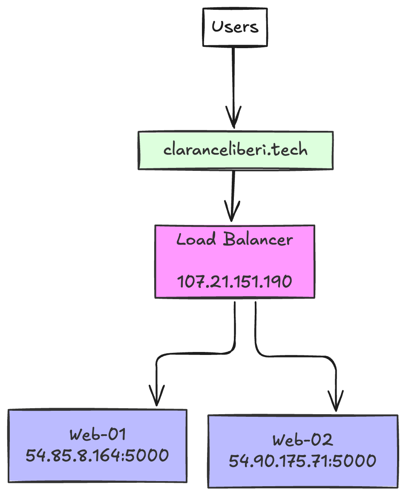

# Global Health Statistics Dashboard

A React-based interactive dashboard that visualizes global health statistics across different countries and metrics.

## Overview

The Global Health Statistics Dashboard allows users to:
- Compare health metrics across multiple countries
- Visualize data through interactive charts
- Filter data by year range
- Switch between different health indicators

## Features

- 🌍 Compare up to 3 countries simultaneously
- 📊 Interactive line and bar charts
- ⏳ Year range selection (2015-2023)
- 🔄 Multiple health metrics:
  - Life Expectancy
  - Infant Mortality
  - Health Worker Density
  - Immunization Coverage
- 🎨 Clean, responsive UI with Dark/Light mode support

## Tech Stack

- **Frontend Framework:** React
- **Build Tool:** Vite
- **Styling:** TailwindCSS
- **Charts:** Recharts
- **TypeScript:** For type safety
- **State Management:** React Hooks
- **HTTP Client:** Native Fetch API

## Live Demo

Visit [https://www.claranceliberi.tech/](https://www.claranceliberi.tech/) to see the live application.

## Getting Started

### Prerequisites

- Node.js (v14 or higher)
- npm or yarn

### Installation

1. Clone the repository:
```bash
git clone git@github.com:claranceliberi/health.git
cd health
```

2. Install dependencies:
```bash
npm install
# or
yarn install
```

3. Start the development server:
```bash
npm run dev
# or
yarn dev
```

4. Open [http://localhost:5173](http://localhost:5173) in your browser

## Project Structure

```
src/
├── components/          # React components
├── config/             # Configuration files
├── hooks/              # Custom React hooks
├── lib/                # Utility functions
├── services/           # API services
├── types/              # TypeScript types
└── App.tsx             # Main application component
```

## Usage

1. Select countries from the dropdown menu (up to 3)
2. Choose a health metric to compare
3. Adjust the year range using the filter panel
4. Toggle between line and bar chart views
5. Hover over the chart to see detailed data points

## Live Demo

Visit [https://www.claranceliberi.tech/](https://www.claranceliberi.tech/) to see the live application.

📺 Watch the [Video Demo on YouTube](https://youtu.be/wdzTz1DY_q0) to see the application in action.

## Development

### Available Scripts

- `npm run dev` - Start development server
- `npm run build` - Build for production
- `npm run preview` - Preview production build
- `npm run lint` - Run ESLint

### Contributing

1. Fork the repository
2. Create your feature branch (`git checkout -b feature/AmazingFeature`)
3. Commit your changes (`git commit -m 'Add some AmazingFeature'`)
4. Push to the branch (`git push origin feature/AmazingFeature`)
5. Open a Pull Request

## Deployment

### ARchtecture



### Infrastructure Overview

The application is deployed using a three-server infrastructure with load balancing:

- **Load Balancer (6243-lb-01):** 107.21.151.190
- **Web Server 1 (6243-web-01):** 54.85.8.164
- **Web Server 2 (6243-web-02):** 54.90.175.71

### Implementation Details

1. **Web Servers Setup:**
   - Repository cloned on both web servers
   - Dependencies installed and project built
   - NGINX configured to listen on port 5000

2. **Load Balancer Configuration:**
   - HAProxy implemented for traffic distribution
   - All requests to https://www.claranceliberi.tech/ routed through load balancer
   - Traffic distributed between web-01 and web-02

The deployment ensures high availability and efficient traffic distribution across the infrastructure.

## License

ISC License

## Acknowledgments

- World Health Organization for providing health data
- [Recharts](https://recharts.org/) for the charting library
- [TailwindCSS](https://tailwindcss.com/) for styling
- [Lucide](https://lucide.dev/) for icons

## Contact

Clarance Liberi
- Email: [liberintwari@gmail.com](mailto:liberintwari@gmail.com), [n.liberiste@alustudent.com](mailto:n.liberiste@alustudent.com)
- Project Link: [https://github.com/claranceliberi/health](https://github.com/claranceliberi/health)
